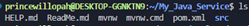

Qwen3-235B-A22B-2507
11:15 AM
Absolutely! This is a fantastic way to level up your DevOps journey — building a polyglot microservices architecture with React + Java + MySQL, alongside your existing Node.js services.

We’ll build a new Java microservice that:

Serves dynamic text from a MySQL database
Exposes a REST API (GET /api/text)
Is consumed by your React frontend
Is production-ready in design (logging, config, health checks, etc.)
And we’ll do it step-by-step, with clear explanations so you learn Java and deployment along the way — even if you’ve never written Java before.

✅ Final Goal
Your React frontend will display:

1
This is a Java micro-service. This text is from the MySQL DB.
...but the text comes from a MySQL database, served via a Java Spring Boot microservice.

🧱 Tech Stack Overview
LAYER
TECHNOLOGY
Frontend
React (already exists)
New Microservice
Java 17 + Spring Boot 3
Database
MySQL 8
Build Tool
Maven
API Format
JSON REST
Deployment Prep
Docker (containerization)
Future Use
Can be orchestrated with Kubernetes, Docker Compose, etc.

🚀 Step-by-Step Guide: Java Microservice with MySQL
We’ll go through:

✅ Setting up the Java project

✅ Writing the Java code (Spring Boot)

✅ Configuring MySQL

✅ Testing locally

✅ Dockerizing it

✅ How React will consume it

✅ DevOps notes for production

Let’s begin!

🔧 Step 1: Set Up the Java Project (No Prior Java Knowledge Needed)
We’ll use Spring Initializr to generate a starter project.

Go to: https://start.spring.io

Fill in:

- Project: Maven
- Language: Java
- Spring Boot:3.x (latest stable)
- Group: com.example
- Artifact: javatextservice
- Name: javatextservice
- Packaging: Jar
- Java Version: 17 (recommended)

Add Dependencies (Click "Add" under Dependencies):

✅ Spring Web (for REST APIs)

✅ Spring Data JPA (to talk to MySQL)

✅ MySQL Driver

✅ Spring Boot Actuator (for health checks – production best practice)

Click "Generate", download the ZIP, and extract it.

