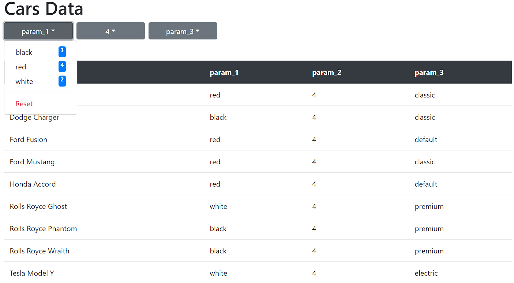

# Car dealer website
A simple project of a website that could be used for selling cars (or whatever else data is inside the database). .

Website is created dynamically and size of the table and number of dropdown buttons and elements inside of them depends on amount of data and amount of columns in database. User can filter values in each parameter by using the dropdown buttons and selecting value they want. Each filter cuts amount of data in the table but also number of elements inside the dropdown lists (both are fetched from apis that get response from database after every choice that user make).

##### To Begin, navigate to any of the versions       `Local-Version`, `VM-Server-Version` or `Containerized-Version` and follow the `README.md` instructions

## Good luck

