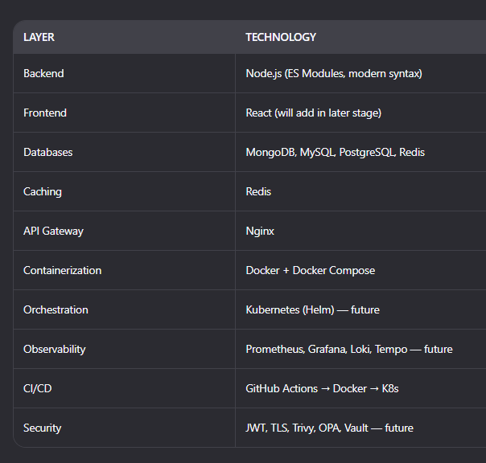
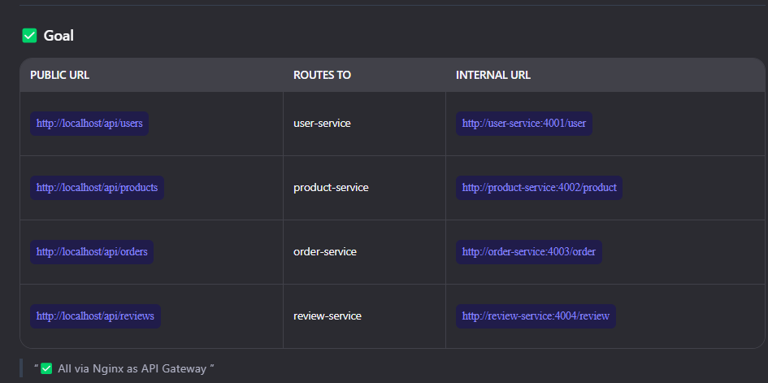
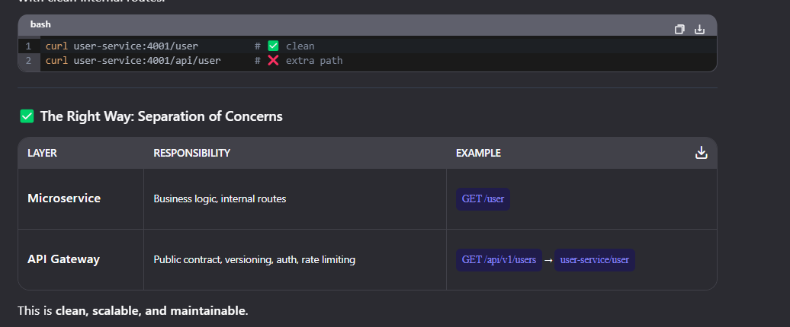

microservices-demo/
├── docker-compose.yml
├── nginx/
│   └── nginx.conf
├── services/
│   ├── user-service/
│   │   ├── server.js
│   │   ├── package.json
│   │   └── Dockerfile
│   ├── product-service/
│   │   ├── server.js
│   │   ├── package.json
│   │   └── Dockerfile
│   ├── order-service/
│   │   ├── server.js
│   │   ├── package.json
│   │   └── Dockerfile
│   ├── review-service/
│   │   ├── server.js
│   │   ├── package.json
│   │   └── Dockerfile
│   └── api-gateway/ (optional placeholder)
├── docker/
│   └── mongodb-init.js (if needed)
└── .gitignore

⚖️ So the difference is:
If you’re calling the microservice directly (internal dev/test), don’t prefix with /api/.
If you’re exposing to the outside world through the API Gateway, use /api/v1/....