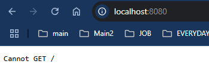
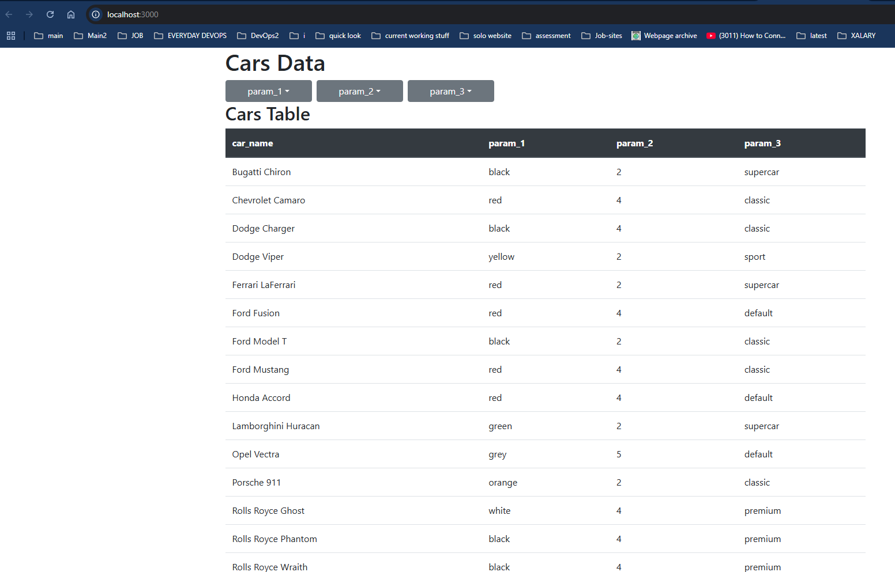

# Car dealer website
A simple project of a website that could be used for selling cars (or whatever else data is inside the database). 


Website is created dynamically and size of the table and number of dropdown buttons and elements inside of them depends on amount of data and amount of columns in database. User can filter values in each parameter by using the dropdown buttons and selecting value they want. Each filter cuts amount of data in the table but also number of elements inside the dropdown lists (both are fetched from apis that get response from database after every choice that user make).


✅ **Run this MERN-like stack (React, Node, Postgres) locally**
✅ **Expose it via your VM’s public IP**

---

## 📌 Local Setup Guide (or on your VM)

### 📁 Project Structure 

```
project/
├── database/
│   └── dbexport.pgsql
├── frontend/
│   ├── package.json
│   ├── src/
│   │   └── App.js
|   |   └── index.js
│   └── setupProxy.js
└── server/
    ├── package.json
    └── index.js

```

---

## 1️⃣ Install Required Tools

On your VM (Debian/Ubuntu based assumed):

```bash
sudo apt update
sudo apt install postgresql postgresql-contrib nodejs npm -y
```

Check versions:

```bash
psql --version
node -v
npm -v
```

---

## 2️⃣ Set Up PostgreSQL

### 🔸 Create database, user, and import dump

1. Access psql as the `postgres` user:

    ```bash
    sudo -u postgres psql
    ```

2. Run:

    ```sql
    CREATE DATABASE cars_db;
    CREATE USER python WITH PASSWORD 'snake';
    GRANT ALL PRIVILEGES ON DATABASE cars_db TO python;
    \q
    ```

3. Import your dump:

    ```bash
    sudo -u postgres psql -d cars_db -f /path/to/database/dbexport.pgsql
    ```
    If you are in the directtory of the project, just use `sudo -u postgres psql -d cars_db -f database/dbexport.pgsql`

4. Confirm:

    ```bash
    sudo -u postgres psql -d cars_db -c "\dt"
    sudo -u postgres psql -d cars_db -c "SELECT * FROM cars;"
    ```
    (see result on first screenshot)<br><br>

---
---
<br>

### 3️⃣ Install Server Dependencies & Run Server

```bash
    cd /path/to/server
    npm install express body-parser pg cors http-proxy-middleware
    npm run server
```

It should say:

> Server is running on [http://localhost:8080](http://localhost:8080)<br>
See second screenshot nut this will show error page because there is nothing set for that page(this is normal)

---

## 4️⃣ Install Frontend Dependencies & Run React App

```bash
cd /path/to/frontend
npm install
npm start
```

By default it runs on `http://localhost:3000`<br>
See third screenshot

If both work: ✅ Local is up.

---

## 5️⃣ Expose via VM IP

Assuming your VM’s public IP is `192.0.2.123`

### 🔸 Update Server to Listen on `0.0.0.0`

In `server/index.js`

```js
app.listen(port, '0.0.0.0', () => {
  console.log(`Server is running on http://0.0.0.0:${port}`);
});
```

Restart:

```bash
node index.js
```

Now your backend API is reachable at `http://<VM-IP>:8080/api`

---

## 6️⃣ Update Frontend Proxy for VM IP

In `frontend/setupProxy.js`:

```js
const { createProxyMiddleware } = require('http-proxy-middleware');

module.exports = function(app) {
  app.use(
    '/api',
    createProxyMiddleware({
      target: 'http://192.0.2.123:8080',
      changeOrigin: true,
    })
  );
};
```

Restart React app:

```bash
npm start
```

Now access frontend from your browser:

> `http://192.0.2.123:3000`

---

## 7️⃣ Open Firewall Ports (if needed)

On your VM:

```bash
sudo ufw allow 3000/tcp
sudo ufw allow 8080/tcp
sudo ufw allow 5432/tcp  # optional if Postgres needs remote access
```

Check status:

```bash
sudo ufw status
```

---

## ✅ Optional: Dockerize it 

---

## 📌 Summary

| Component    | Local Port | Public IP Access                    |
| :----------- | :--------- | :---------------------------------- |
| React App    | `3000`     | `http://<VM-IP>:3000`               |
| Node Backend | `8080`     | `http://<VM-IP>:8080`               |
| PostgreSQL   | `5432`     | Local only unless explicitly opened |

---

## 💡 Final Note:

* Never expose Postgres publicly unless secured via SSL or SSH tunnel.
* For production: you'd proxy React via `Nginx` or `Caddy` and run backend behind a `reverse proxy` too.

---

## Images







<!-- 
```
project/
├── database/
│   └── dbexport.pgsql
├── frontend/
│   ├── package.json
│   ├── src/
│   │   └── App.js
        └── index.js
│   └── setupProxy.js
├── server/
│   ├── package.json
│   └── index.js
└── docker-compose.yml (optional later)
``` -->