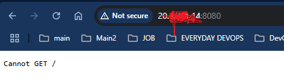
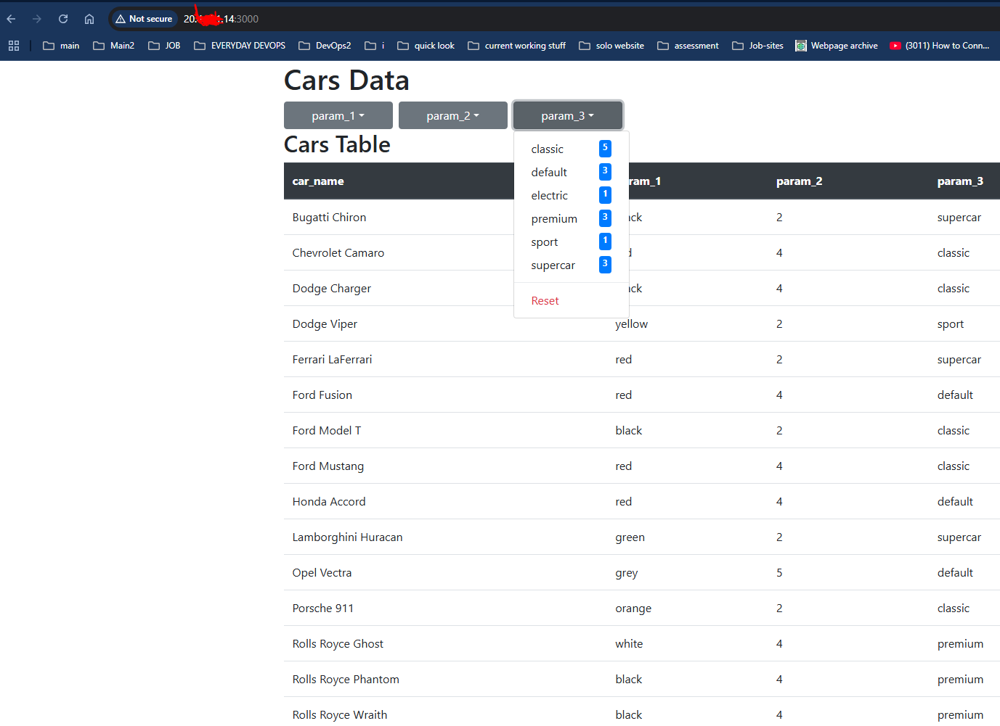

# 🚗 Car Dealer Website (React, Node, PostgreSQL)

A lightweight dynamic car catalog website where the table structure and dropdown filters auto-generate based on data fetched from a PostgreSQL database via a Node.js backend. Users can filter cars via dropdowns — each selection refines both the table and dropdown options dynamically.

* Remove local dev stuff
* Use `.env` files for backend and frontend from `.env.example`


## 📦 Tech Stack

* **React (Frontend)**
* **Node.js + Express (API Server)**
* **PostgreSQL (Database)**

---

## 📌 Production Deployment Guide (on a VM)

This guide will help you deploy the full stack directly on a production VM (Ubuntu/Debian-based assumed).

---

## 📁 Project Structure

```
project/
├── database/
│   └── dbexport.pgsql
├── frontend/
│   ├── package.json
│   ├── .env
│   └── src/
│       └── App.js
|       └── index.js
├── server/
│   ├── package.json
│   ├── .env
│   └── index.js
└── README.md
```

---

## 1️⃣ Install Required Tools

On your VM:

```bash
sudo apt update
sudo apt install postgresql postgresql-contrib nodejs npm -y
```

Check versions:

```bash
psql --version
node -v
npm -v
```

---

## 2️⃣ Set Up PostgreSQL Database

1️⃣ Login as the `postgres` user:

```bash
sudo -u postgres psql
```

2️⃣ Create database and user:

```sql
CREATE DATABASE cars_db;
CREATE USER python WITH PASSWORD 'snake';
GRANT ALL PRIVILEGES ON DATABASE cars_db TO python;
\q
```

3️⃣ Import your dump:

```bash
sudo -u postgres psql -d cars_db -f /absolute/path/to/database/dbexport.pgsql
```

If already inside project folder:

```bash
sudo -u postgres psql -d cars_db -f database/dbexport.pgsql
```

4️⃣ Verify data:

```bash
sudo -u postgres psql -d cars_db -c "\dt"
sudo -u postgres psql -d cars_db -c "SELECT * FROM cars;"
```

---

## 3️⃣ Backend (Node API) Setup

1️⃣ Go to `server/`:

```bash
cd /path/to/server
```

2️⃣ Create a `.env` file:

```bash
touch .env
```

Add:

```env
PORT=8080
PGUSER=python
PGHOST=localhost
PGDATABASE=cars_db
PGPASSWORD=snake
PGPORT=5432
```

3️⃣ Install dependencies:

```bash
npm install express body-parser pg cors dotenv
```

5️⃣ Start backend server:

```bash
node index.js
```

Should log:

> Server is running on [http://0.0.0.0:8080](http://0.0.0.0:8080)

---

## 4️⃣ Frontend (React App) Setup

1️⃣ Go to `frontend/`:

```bash
cd /path/to/frontend
```

2️⃣ Create a `.env` file:

```bash
touch .env
```

Add your VM’s public IP:

```env
REACT_APP_API_BASE_URL=http://<YOUR_VM_IP>:8080
```

3️⃣ Install dependencies:

```bash
npm install
```

4️⃣ Update `App.js` fetch URLs:

Change all:

```javascript
await fetch('/api/...')
```

To:

```javascript
await fetch(`${process.env.REACT_APP_API_BASE_URL}/api/...`)
```

✅ Done already in your provided plan — leave it as is.

5️⃣ Build frontend:

```bash
npm run build
```

This will generate a `build/` folder with static production-ready files.

---

## 5️⃣ Serve Frontend with Nginx (Recommended)

**Optional but pro-grade**

1️⃣ Install Nginx:

```bash
sudo apt install nginx -y
```

2️⃣ Copy `build/` content to `/var/www/html/` or another web root.

3️⃣ Update Nginx config to serve static files and optionally reverse proxy API requests.

---

## 6️⃣ Open Firewall Ports (If UFW Enabled)

```bash
sudo ufw allow 8080/tcp
sudo ufw allow 80/tcp
sudo ufw allow 5432/tcp  # optional — only if external DB access needed
sudo ufw status
```

---

## 📌 Summary

| Component    | Production Port  | VM Public Access                    |
| :----------- | :--------------- | :---------------------------------- |
| React App    | served via Nginx | `http://<VM-IP>`                    |
| Node Backend | `8080`           | `http://<VM-IP>:8080/api`           |
| PostgreSQL   | `5432` (local)   | local-only unless opened explicitly |

---

## 📌 Security Notes

* Never expose PostgreSQL directly unless secured.
* Use `.env` files for all sensitive configs.
* In production, always serve React via Nginx or Caddy.

---

## Images






