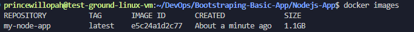
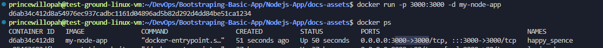
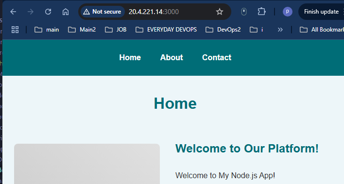

-*+
### Step 1: Create a Basic Node.js App
 **1. Initialize the Project**

- Create a directory for your app
    ```javascript
    mkdir my-node-app
    cd my-node-app
    npm init -y
    ```
- This creates a `package.json` file

<br>

**2. Install Express framework**
- `sudo npm install express`

<br>

**3. Create the App**

- **Create a file named app.js with this basic Express server:**

```javascript
    const express = require('express');
    const app = express();
    const port = 3000;
    
    app.get('/', (req, res) => {
        res.send('Hello from your Node.js app!');
    });
    
    app.listen(port, () => {
        console.log(`Server running at http://localhost:${port}`);
    });
```

<br>

**4. Test Locally**
- Run the app:
    `node app.js`
- Visit `http://localhost:3000` or `<your-VM-IP>:3000` in your browser. You should see "Hello from your Node.js app!"
- Stop the server with Ctrl+C.


### To enhance the website, we will follow the folder structure
```
my-node-app/
├── public/
│   ├── css/
│   │   └── style.css
├── views/
│   ├── partials/
│   │   ├── header.ejs
│   │   └── footer.ejs
│   ├── home.ejs
│   ├── about.ejs
│   └── contact.ejs
├── routes/
│   ├── index.js
│   └── about.js
├── app.js
├── package.json
└── README.md
```
## Setup Instructions
#### 1. Create the Project
- **Make a directory8**: `mkdir my-node-app && cd my-node-app`
- **Initialize**: `npm init -y`
- **Install dependencies**: `sudo npm install express ejs`

#### 2. Create Files
- Create the folders `(public/css, views/partials, routes)` and files as shown below.
- Copy each file’s content exactly as provided.

#### 3. Run the App
- **Start**: `node app.js`
- **Visit**: `http://localhost:3000` in your browser.
- **Test routes**: `/` (home), `/about` (about), `/contact` (contact form).


## File 1: package.json

**Purpose**: Defines the project, dependencies, and scripts
```json
{
  "name": "my-node-app",
  "version": "1.0.0",
  "description": "Enhanced Node.js app with Express, EJS, and routes",
  "main": "app.js",
  "scripts": {
    "start": "node app.js"
  },
  "keywords": [],
  "author": "",
  "license": "ISC",
  "dependencies": {
    "ejs": "^3.1.10",
    "express": "^4.19.2"
  }
}
```
**Details:** 
 -  `express`: Web framework for routing and server.
 -  `ejs`: Templating engine for dynamic HTML.
 -  `scripts`: Run with `npm start` or `node app.js`.


 ## File 2: app.js
 **Purpose**: Main server file, sets up Express, EJS, routes, and static files.
 ```javascript
    const express = require('express');
    const path = require('path');
    const indexRouter = require('./routes/index');
    const aboutRouter = require('./routes/about');
    
    const app = express();
    const port = 3000;
    
    // Set EJS as the templating engine
    app.set('view engine', 'ejs');
    app.set('views', path.join(__dirname, 'views'));
    
    // Serve static files (CSS, etc.) from 'public' folder
    app.use(express.static(path.join(__dirname, 'public')));
    
    // Parse form data
    app.use(express.urlencoded({ extended: true }));
    
    // Use routes
    app.use('/', indexRouter);
    app.use('/about', aboutRouter);
    
    // 404 Error handling
    app.use((req, res) => {
      res.status(404).render('home', { title: '404 - Page Not Found', message: 'Sorry, that page doesn’t exist!' });
    });
    
    // Start the server
    app.listen(port, () => {
      console.log(`Server running at http://localhost:${port}`);
    });
 ```
 **Details:**
   - EJS: Configured as the view engine, with templates in views/.
   - Static Files: CSS and other assets served from public/.
   - Form Parsing: express.urlencoded handles contact form data.
   - Routes: Modular routes from routes/ folder.
   - 404: Fallback page for invalid routes.


## File 3: routes/index.js
**Purpose**: Handles routes for home and contact pages.
```javascript 
    const express = require('express');
    const router = express.Router();
    
    // Home page route
    router.get('/', (req, res) => {
      res.render('home', { title: 'Home', message: 'Welcome to My Node.js App!' });
    });
    
    // Contact page route
    router.get('/contact', (req, res) => {
      res.render('contact', { title: 'Contact Us', message: '' });
    });
    
    // Handle contact form submission
    router.post('/contact', (req, res) => {
      const { name, email, message } = req.body;
      console.log('Form submission:', { name, email, message });
      res.render('contact', { title: 'Contact Us', message: 'Thank you, ' + name + '! Your message has been received.' });
    });
    
    module.exports = router;
```
**Details**: 
  - GET /: Renders the home page with a welcome message.
  - GET /contact: Shows the contact form.
  - POST /contact: Logs form data to console and displays a confirmation.
  - Modular: Exported as a router for use in app.js.


## File 4: routes/about.js
**Purpose**: Handles the about page route.
```javascript  
    const express = require('express');
    const router = express.Router();
    
    // About page route
    router.get('/', (req, res) => {
      res.render('about', { title: 'About Us', content: 'This is a simple Node.js app built with Express and EJS. Learn more about us here!' });
    });
    
    module.exports = router;
```
**Details:**

- GET /: Renders the about page with content.
- Path: Mounted at /about in app.js, so the full route is /about.


## File 5: views/partials/header.ejs
**Purpose:** Reusable header with navigation, included in all pages.
```HTML
<!DOCTYPE html>
<html lang="en">
<head>
  <meta charset="UTF-8">
  <meta name="viewport" content="width=device-width, initial-scale=1.0">
  <title><%= title %></title>
  <link rel="stylesheet" href="/css/style.css">
</head>
<body>
  <nav>
    <ul>
      <li><a href="/">Home</a></li>
      <li><a href="/about">About</a></li>
      <li><a href="/contact">Contact</a></li>
    </ul>
  </nav>
  <div class="container">
```
***Details***: 
- Dynamic Title: Uses <%= title %> from route data.
- CSS: Links to style.css in public/css.
- Nav: Links to all routes for easy navigation.
- Container: Wraps page content for styling.


## File 6: views/partials/footer.ejs
**Purpose:** Reusable footer, closes the HTML structure.
```HTML
  </div>
  <footer>
    <p>© 2025 My Node.js App. All rights reserved.</p>
  </footer>
</body>
</html>
```
**Details:**
- Closes the `<div class="container">` from header.ejs.
- Adds a simple footer with a copyright notice.


## File 7: views/home.ejs
**Purpose:** Template for the home page.
```javascript
<%- include('partials/header') %>
  <h1><%= title %></h1>
  <div class="hero">
    <div class="hero-image"></div>
    <div class="hero-content">
      <h2>Welcome to Our Platform!</h2>
      <p><%= message %></p>
      <p>We’re thrilled to have you here! Explore our services, learn about our mission, and get in touch. Our app is designed to make your experience seamless and engaging, with tools and features tailored to your needs.</p>
      <a href="/contact" class="btn">Get Started</a>
    </div>
  </div>
  <section class="features">
    <h2>Our Features</h2>
    <div class="feature-grid">
      <div class="feature-card">
        <div class="feature-icon"></div>
        <h3>Fast & Reliable</h3>
        <p>Enjoy lightning-fast performance with our optimized platform, built for speed and reliability.</p>
      </div>
      <div class="feature-card">
        <div class="feature-icon"></div>
        <h3>User-Friendly</h3>
        <p>Navigate with ease thanks to our intuitive design and clear layout.</p>
      </div>
      <div class="feature-card">
        <div class="feature-icon"></div>
        <h3>24/7 Support</h3>
        <p>We’re here for you anytime—reach out via our contact page!</p>
      </div>
    </div>
  </section>
<%- include('partials/footer') %>
```
**Details:** 
- Partials: Includes header and footer for consistency.
- Dynamic: Renders title and message from the route.


## File 8: views/about.ejs
**Purpose:** Template for the about page.
```javascript
<%- include('partials/header') %>
  <h1><%= title %></h1>
  <div class="about-intro">
    <div class="about-image"></div>
    <p><%= content %></p>
    <p>Founded in 2020, we’ve grown into a passionate team dedicated to innovation. Our goal is to bridge technology and user needs, delivering solutions that matter. We value creativity, collaboration, and excellence.</p>
  </div>
  <section class="team">
    <h2>Meet Our Team</h2>
    <div class="team-grid">
      <div class="team-member">
        <div class="team-photo"></div>
        <h3>Jane Doe</h3>
        <p>Founder & CEO</p>
        <p>Jane leads with vision, driving our mission forward with 10+ years in tech.</p>
      </div>
      <div class="team-member">
        <div class="team-photo"></div>
        <h3>John Smith</h3>
        <p>Lead Developer</p>
        <p>John crafts robust code, ensuring our app runs smoothly and efficiently.</p>
      </div>
    </div>
  </section>
<%- include('partials/footer') %>
```
**Details:** 
- Displays the title and content passed from routes/about.js.
- Uses partials for header and footer.


## File 9: views/contact.ejs
**Purpose:** Template for the contact page with a form.
```javascript
<%- include('partials/header') %>
  <h1><%= title %></h1>
  <div class="contact-intro">
    <div class="contact-image"></div>
    <p>We’d love to hear from you! Whether you have questions, feedback, or need support, fill out the form below, and we’ll get back to you within 24 hours.</p>
    <% if (message) { %>
      <p class="success"><%= message %></p>
    <% } %>
  </div>
  <section class="contact-form">
    <h2>Send Us a Message</h2>
    <form action="/contact" method="POST">
      <label for="name">Your Name:</label>
      <input type="text" id="name" name="name" placeholder="Enter your full name" required>
      <label for="email">Your Email:</label>
      <input type="email" id="email" name="email" placeholder="Enter your email address" required>
      <label for="subject">Subject:</label>
      <input type="text" id="subject" name="subject" placeholder="What’s this about?" required>
      <label for="message">Your Message:</label>
      <textarea id="message" name="message" placeholder="Tell us more..." required></textarea>
      <button type="submit" class="btn">Send Message</button>
    </form>
  </section>
<%- include('partials/footer') %>
```
**Details:** 
- Form: Submits to /contact via POST, with fields for name, email, and message.
- Conditional: Shows a success message if message exists (after form submission).
- Required: Form fields enforce input with required.


## File 10: public/css/style.css
**Purpose:** Styles the app for a clean, responsive look.
```css
* {
  margin: 0;
  padding: 0;
  box-sizing: border-box;
}

body {
  font-family: Arial, sans-serif;
  line-height: 1.6;
  color: #333;
  background-color: #edf6f9;
}

nav {
  background-color: #006d77;
  padding: 1.5rem;
}

nav ul {
  list-style: none;
  display: flex;
  justify-content: center;
  gap: 2.5rem;
}

nav a {
  color: #fff;
  text-decoration: none;
  font-weight: bold;
  transition: color 0.3s ease;
}

nav a:hover {
  color: #ff6f61;
}

.container {
  max-width: 900px;
  margin: 2rem auto;
  padding: 0 1.5rem;
}

h1 {
  color: #006d77;
  margin-bottom: 1.5rem;
  text-align: center;
}

h2 {
  color: #006d77;
  margin: 1.5rem 0;
}

h3 {
  color: #ff6f61;
  margin: 0.5rem 0;
}

/* Hero Section */
.hero {
  display: flex;
  gap: 2rem;
  align-items: center;
  margin-bottom: 2rem;
  flex-wrap: wrap;
}

.hero-image {
  width: 300px;
  height: 200px;
  background-color: #ccc;
  background: linear-gradient(45deg, #ccc, #e0e0e0);
  border-radius: 8px;
  flex-shrink: 0;
}

.hero-content {
  flex: 1;
  min-width: 300px;
}

/* Features Section */
.features, .team, .contact-form {
  background-color: #fff;
  padding: 2rem;
  border-radius: 8px;
  box-shadow: 0 2px 10px rgba(0, 0, 0, 0.1);
  margin-bottom: 2rem;
}

.feature-grid, .team-grid {
  display: grid;
  grid-template-columns: repeat(auto-fit, minmax(250px, 1fr));
  gap: 1.5rem;
}

.feature-card, .team-member {
  background-color: #edf6f9;
  padding: 1.5rem;
  border-radius: 8px;
  text-align: center;
}

.feature-icon, .team-photo {
  width: 80px;
  height: 80px;
  background-color: #ccc;
  background: linear-gradient(45deg, #ccc, #e0e0e0);
  border-radius: 50%;
  margin: 0 auto 1rem;
}

/* About Section */
.about-intro {
  display: flex;
  gap: 2rem;
  align-items: center;
  margin-bottom: 2rem;
  flex-wrap: wrap;
}

.about-image {
  width: 300px;
  height: 200px;
  background-color: #ccc;
  background: linear-gradient(45deg, #ccc, #e0e0e0);
  border-radius: 8px;
  flex-shrink: 0;
}

/* Contact Section */
.contact-intro {
  display: flex;
  gap: 2rem;
  align-items: center;
  margin-bottom: 2rem;
  flex-wrap: wrap;
}

.contact-image {
  width: 300px;
  height: 200px;
  background-color: #ccc;
  background: linear-gradient(45deg, #ccc, #e0e0e0);
  border-radius: 8px;
  flex-shrink: 0;
}

form {
  display: flex;
  flex-direction: column;
  gap: 1.2rem;
  max-width: 600px;
  margin: 0 auto;
}

label {
  font-weight: bold;
  color: #006d77;
}

input, textarea {
  padding: 0.75rem;
  border: 1px solid #ccc;
  border-radius: 6px;
  font-size: 1rem;
  background-color: #fff;
  transition: border-color 0.3s ease;
}

input:focus, textarea:focus {
  border-color: #ff6f61;
  outline: none;
}

textarea {
  resize: vertical;
  min-height: 120px;
}

.btn {
  background-color: #ff6f61;
  color: white;
  padding: 0.75rem 1.5rem;
  border: none;
  border-radius: 6px;
  cursor: pointer;
  font-size: 1rem;
  text-align: center;
  text-decoration: none;
  transition: background-color 0.3s ease;
}

.btn:hover {
  background-color: #e65b50;
}

.success {
  color: #27ae60;
  font-weight: bold;
  text-align: center;
  margin: 1rem 0;
}

footer {
  text-align: center;
  padding: 1.5rem;
  background-color: #006d77;
  color: #fff;
  margin-top: 2rem;
}
```
**Details:** 
- Reset: * resets margins and padding.
- Nav: Dark background, centered links with hover effect.
- Layout: .container centers content, max 800px wide.
- Form: Styled inputs, textarea, and button with hover.
- Colors: Dark blue for nav, lighter blue for buttons, green for success messages.


## File 11: README.md
**Purpose:** Documents the project for setup and usage.
```md
# My Node.js App

A simple Node.js application using Express, EJS templating, and modular routes.

## Setup
1. Install dependencies: `npm install`
2. Run the app: `node app.js`
3. Visit `http://localhost:3000`

## Routes
- `/`: Home page
- `/about`: About page
- `/contact`: Contact form (logs to console)

## Dependencies
- Express: Web framework
- EJS: Templating engine

## Notes
- Static files (CSS) are in `public/`
- Views and partials are in `views/`
- Routes are modularized in `routes/`
```
**Details:** 
- Guides setup, lists routes, and explains structure.
- Useful for future reference or collaboration.


-----------------------------

### Why EJS?
- **Choice**: EJS is lightweight, integrates well with Express, and allows dynamic HTML with JavaScript-like syntax.
- **Partials**: Reusable header.ejs and footer.ejs reduce code duplication.
- **Alternatives**: You could use Pug or Handlebars, but EJS is simple and popular.
### How It Works
- **Start**: app.js sets up the server, EJS, and routes.
- **Routes**: index.js handles / and /contact, about.js handles /about.
- **Views**: EJS templates render dynamic content, using partials for nav and footer.
- **Styling**: CSS in public/css/style.css makes the app look clean and responsive.
- **Form**: The contact form submits data, logs it to the console, and shows a success message.
### Next Steps
- **Test**: Create all files, run npm install, then node app.js. Check all routes.
- **Enhance**: 
    - Add a database (e.g., MongoDB) to store contact form submissions.
    - Use PM2 for production: pm2 start app.js --name "my-app".
    - Add more routes or styles as needed.
- **Deploy**: Use the Docker or VM setup from my earlier response

<br/>


___
### To Dockerize the Nodejs App
___


##### Docker containerizes your app, making it portable and consistent across environments.

**Prerequisites**
- Install Docker on your machine.
- Ensure Node.js and npm are installed locally to build the app.

### Steps
**1.  Create a `Dockerfile**
- In your `my-node-app` directory, create a file named `Dockerfile` (no extension)

```dockerfile
# Use an official Node.js runtime as the base image
FROM node:18

# Set the working directory in the container
WORKDIR /usr/src/app

# Copy package.json and package-lock.json
COPY package*.json ./

# Install dependencies
RUN npm install

# Copy the rest of the app files
COPY . .

# Expose the port the app runs on
EXPOSE 3000

# Command to run the app
CMD ["node", "app.js"]
```
**2. Build the Docker Image**

- Run this command in the `my-node-app` directory
```dockerfile
docker build -t my-node-app .
```
- Explanation: 
    - This builds an image named `my-node-app` based on the Dockerfile.
    - `t`: stands for latest tag
    - `.` Stands for the *current directory* where `Dockerfile` is found
    - The screenshot below shows the image being built with a lates tag and a name `my-node-app` and image size is about 1.1GB

    


**3. Run the Docker Container**
- Start the container: `docker run -p  -d <host-or-VM-port>:<docker-container-port> -n <container-name> <image-name>:<tag>`
```dockerfile
docker run -p 3000:3000 -d my-node-app
```
- Explanation:
    -   `-p 3000:3000`: Maps port 3000 on your host to port 3000 in the container.
    -   `-d`: Runs the container in detached (background) mode.
- Check `http://localhost:3000` or `your-VM-IP>:3000` e.g `20.4.221.14:3000` in your browser. You should see the "Hello" message.
- Make sure the VM has exposed port `3000` inbound traffic
   
 
**4. Manage the Container**
- List running containers:
    ```dockerfile
    docker ps
    ```
- Stop the container:
    ```dockerfile
    docker stop <container-id>
    ```
   (Replace `<container-id>` with the ID from docker ps.)

- View logs:
    ```dockerfile
    docker logs <container-id>
    ```

**5. Optional: Push to Docker Hub**
- **Tag your image:**
    ```dockerfile
    docker tag my-node-app yourusername/my-node-app:latest
    e.g
    docker tag my-node-app princewillopah/my-node-app:latest
    ```
- **Log in to Docker Hub**:

    ```dockerfile
    docker login
    ```

- **Push the image:**

    ```dockerfile
    docker push yourusername/my-node-app:latest
    Or
    docker push princewillopah/my-node-app:latest
    ```
You can now pull and run this image on any Docker-enabled server.
### To use the pushed image from dockerhub:


 - **Pull the image to ba available on your server**: `docker pull yourusername/my-node-app:latest`
    -   *Note that ou may have to login to pull the image if the repo is private*
 
 - **Run a container from it**: `docker run -d -p 3000:3000 yourusername/my-node-app:latest`

- **Example::**
```docker
docker pull princewillopah/my-node-app:latest
docker run -d -p 3000:3000 --name my-nodejs-app-container princewillopah/my-node-app:latest
```


<br>
<br>
<br>


---
---

### Method 2: Hosting on a VM Server

---
---


This method involves setting up the app directly on a virtual machine (e.g., a cloud VM like AWS EC2, Google Cloud, or a local VM via VirtualBox/VMware).

**Prerequisites**
- A VM running a Linux distro (e.g., Ubuntu 20.04 or later).
- SSH access to the VM (e.g., via ssh user@vm-ip-address).
- Basic tools installed: Node.js, npm, and a process manager like PM2.

### Steps
**1. Set Up the VM**
- **Connect to the VM:** `ssh user@vm-ip-address`
- **Update the system:** `sudo apt update && sudo apt upgrade -y`

**2. Install Node.js and npm**
- **Install Node.js (e.g., version 18):**
    - `curl -fsSL https://deb.nodesource.com/setup_18.x | sudo -E bash -`
    - `sudo apt install -y nodejs`

- **Verify installation:**
    - `node --version`
    - `npm --version`

**3. Transfer Your App**

- **Option 1: Copy files via SCP**
    - From your local machine, run: `scp -r my-node-app user@vm-ip-address:/home/user/`
- **Option 2: Use Git**
    - Push your code to a Git repo (e.g., GitHub).
    - On the VM, clone it: 
        - `git clone https://github.com/yourusername/your-repo.git`
        - `cd your-repo`

**4. Install Dependencies**
- Navigate to the app directory on the VM:
    - `cd /home/user/my-node-app`
    - `npm install`

**5. Run the App with PM2**

- **Install PM2 globally:**
`sudo npm install -g pm2`

- **Start the app:**
`pm2 start app.js --name "my-node-app"`

- **Check status:** `pm2 list`

- **Save for auto-restart:**<br> 
`pm2 save`<br>
`pm2 startup`

Follow the generated command to enable PM2 on boot(see` https://pm2.io/` for moe details).

**6. Configure Networking**
- **Open port 3000:**
    - If using a cloud VM (e.g., AWS EC2), update the security group/firewall rules to allow inbound traffic on port 3000 (TCP).
    - For Ubuntu with UFW<br>
    `sudo ufw allow 3000`<br>
    `sudo ufw status`
- **Test the app:**
    - Visit `http://vm-ip-address:3000` in your browser. You should see "Hello from your Node.js app!"

**7. Optional: Set Up a Reverse Proxy (Recommended)**
- Use Nginx to proxy requests and serve on port 80 (HTTP)

    - Install Nginx<br>
        `sudo apt install -y nginx`
    - Create a config file at `/etc/nginx/sites-available/my-node-app`:
    ```nginx
    server {
        listen 80;
        server_name your-domain.com vm-ip-address;

        location / {
            proxy_pass http://localhost:3000;
            proxy_http_version 1.1;
            proxy_set_header Upgrade $http_upgrade;
            proxy_set_header Connection 'upgrade';
            proxy_set_header Host $host;
            proxy_cache_bypass $http_upgrade;
        }
    }
    ```
    - Enable the site:<br>
        `sudo ln -s /etc/nginx/sites-available/my-node-app /etc/nginx/sites-enabled/`<br>
        `sudo nginx -t`<br>
        `sudo systemctl restart nginx`

    - Allow port 80 in the firewall:<br>
        `sudo ufw allow 80`
    - Test: Visit `http://vm-ip-address` or your domain.


--- 

### Key Differences
- **Docker:**
    - Portable, isolated, and easy to deploy anywhere with Docker.
    - Requires Docker installed; uses a Dockerfile to define the environment.

- **VM:**
    - Runs directly on the server, more manual setup.
    - Use PM2 for reliability and Nginx for production-grade access.

### Practical Tips

- **Docker:**
    - Use docker logs to debug issues.
    - Consider Docker Compose for multi-container setups (e.g., with a database).

- **VM:**
    - Secure your VM: Update regularly, limit SSH access, and use strong passwords.
    - Monitor with pm2 monit for CPU/memory usage.

- **Both:**
    - Test locally first.
    - Back up your code and VM data.
    - For production, consider HTTPS (e.g., via Let’s Encrypt).

**Next Steps**

- Try this with your app!
- Let me know if you need help with:
    - Adding a database (e.g., MongoDB).
    - Deploying to a specific cloud provider (e.g., AWS, GCP).
   -  Scaling or securing the setup.